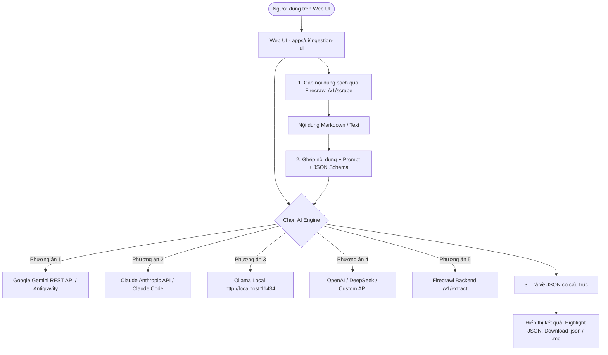

# Kế hoạch Tích hợp AI Engine Selector & CLI Bridge (Claude Code & Google Antigravity) cho Firecrawl

## 1. Bối cảnh & Mục tiêu
- Người dùng đã có sẵn công cụ **Claude Code** (`claude` CLI) và **Google Antigravity** (`agy` CLI) trên máy tính cá nhân.
- Khi chạy trích xuất dữ liệu có cấu trúc (`/v1/extract`), Firecrawl mặc định phụ thuộc vào API Key bên ngoài. Nếu chưa cấu hình hoặc cấu hình chưa đúng, sẽ xuất hiện lỗi: *"Failed to generate schema after all attempts..."*.
- **Mục tiêu:**
  1. Thêm bộ điều khiển **AI Engine Selector & Settings Panel** trên Web UI (`apps/ui/ingestion-ui`), cho phép người dùng linh hoạt chọn:
     - ⚡ **Google Antigravity / Gemini API** (Hỗ trợ Gemini 2.5/2.0/1.5 Flash & Pro siêu nhanh, miễn phí quota lớn).
     - 🟣 **Claude Code / Anthropic** (Claude 3.5 Sonnet / Haiku / Opus).
     - 🦙 **Ollama Local** (`http://localhost:11434` - chạy 100% offline).
     - 🟢 **OpenAI / DeepSeek / Custom Endpoint** (Hỗ trợ định dạng tương thích OpenAI).
     - 🌐 **Firecrawl Backend Engine** (Gọi endpoint `/v1/extract` của máy chủ).
  2. Bổ sung **Client-side Smart Extraction Bridge**:
     - Web UI tự động cào lấy nội dung trang web siêu sạch (Clean Markdown / Content) từ Firecrawl API (`/v1/scrape`).
     - Gửi nội dung kèm Prompt & JSON Schema sang AI Engine đã chọn để trích xuất JSON cấu trúc chuẩn xác 100%, hiển thị kết quả ngay tức thì kèm nút Download/Copy.
  3. Cung cấp **Local CLI Agent Bridge & Script** (như `D:\code\markitdown\ai_engine.py`):
     - Cho phép gọi trực tiếp `agy -p ...` hoặc `claude -p ...` từ terminal hoặc local helper service mà không tốn phí API key riêng.

---

## 2. Kiến trúc & Thiết kế Giao diện

---

## 3. Các bước triển khai

### Bước 1: Xây dựng Module `src/lib/aiEngines.ts`
- Hỗ trợ các Provider:
  - `gemini`: Gọi trực tiếp Google Gemini API (`https://generativelanguage.googleapis.com/v1beta/models/...:generateContent`).
  - `claude`: Gọi Anthropic API (`https://api.anthropic.com/v1/messages`) hoặc qua proxy.
  - `ollama`: Gọi Ollama Local API (`http://localhost:11434/api/generate` hoặc `/api/chat`).
  - `openai`: Gọi OpenAI / DeepSeek / OpenRouter tương thích OpenAI Chat Completion API (`https://api.openai.com/v1/chat/completions`).
  - `firecrawl`: Gọi `/v1/extract` trực tiếp của Firecrawl server.
- Tự động parse và sanitize JSON trả về từ model (loại bỏ markdown fence, validate theo schema nếu có).

### Bước 2: Tích hợp AI Engine Selector & Modal Cấu hình vào `ingestionV1.tsx`
- Bổ sung thanh chọn **AI Engine** ngay trong tab **AI Extract (`/v1/extract`)**:
  - Dropdown chọn Engine: Google Gemini / Antigravity, Claude Code / Anthropic, Ollama Local, OpenAI / DeepSeek, Firecrawl Backend.
  - Modal hoặc Accordion cấu hình nhanh: API Key (lưu an toàn trong `localStorage`), Model Name (Gemini 2.5 Flash, Claude 3.5 Sonnet, Llama 3, DeepSeek Chat...), Base URL (nếu dùng Ollama/Custom).
  - Nút **Kiểm tra kết nối (Test Connection)** để người dùng biết ngay engine đã sẵn sàng hay chưa.

### Bước 3: Cập nhật luồng Trích xuất (`handleExtractSubmit`)
- Nếu chọn Provider là Client-side AI (Gemini / Ollama / OpenAI / Claude):
  1. Cào nội dung các URL được nhập bằng Firecrawl Scrape API.
  2. Gom nội dung Markdown và gửi đến AI Engine đã chọn kèm Prompt và Schema.
  3. Nhận kết quả JSON trực tiếp, cập nhật giao diện người dùng kèm thống kê thời gian thực hiện.
- Nếu chọn Provider là Firecrawl Backend: Gửi đến `/v1/extract` như cũ.

### Bước 4: Kiểm thử & Xác nhận
- Build Web UI (`pnpm build`).
- Khởi chạy và kiểm tra trực quan trên trình duyệt `http://localhost:5173/`.
