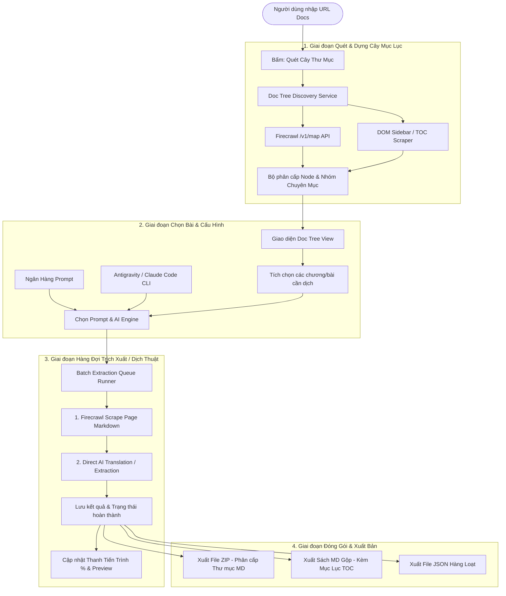

# Kế Hoạch Xây Dựng Tính Năng: Documentation Tree Batch Crawler & AI Extractor
*(Tự động quét toàn bộ cây thư mục tài liệu, trích xuất & dịch thuật hàng loạt, xuất file ZIP / Sách Markdown)*

---

## 1. Tổng Quan & Mục Tiêu

### 1.1 Vấn đề hiện tại
- Người dùng khi đọc tài liệu kỹ thuật hoặc hệ thống lớn (như **Frappe Education**, **Frappe Framework**, **Next.js**, **Kubernetes**...) thường có hàng chục đến hàng trăm bài viết phân cấp theo **Cây thư mục / Sidebar Navigation** (VD: *General Education -> Introduction, Student Management -> Student, Student Group...*).
- Hiện tại hệ thống mới chỉ hỗ trợ trích xuất & dịch thuật từng URL đơn lẻ. Việc copy-paste từng link thủ công rất mất thời gian.

### 1.2 Mục tiêu đạt được
1. **Tự động quét & dựng Cây thư mục (Doc Tree Discovery)** từ một link gốc tài liệu (như `https://docs.frappe.io/education`), lấy toàn bộ danh sách chuyên mục, các mục con và liên kết.
2. **Giao diện Cây thư mục trực quan (Interactive Doc Tree Component)**: Cho phép chọn/bỏ chọn từng chương, từng bài hoặc toàn bộ tài liệu.
3. **Bộ xử lý Hàng đợi Batch AI Translation & Extraction**: Chạy tuần tự/song song với thanh tiến trình thời gian thực, hỗ trợ các AI Engine (Antigravity CLI, Claude Code CLI).
4. **Bộ đóng gói & Xuất bản đa định dạng**:
   - **Xuất ZIP**: Lưu cấu trúc thư mục chuẩn (`chuyen-muc-1/bai-1.md`, `chuyen-muc-1/bai-2.md`...) kèm file `README.md` mục lục.
   - **Xuất Sách Đơn (Merged Single Markdown Book)**: Gộp toàn bộ bài viết thành 1 file Markdown hoàn chỉnh có Mục lục (Table of Contents) liên kết nội bộ.
   - **Xuất Batch JSON**.

---

## 2. Kiến Trúc Hệ Thống & Luồng Hoạt Động (Architecture Flow)



---

## 3. Các Thành Phần Chi Tiết Cần Xây Dựng

### 3.1 Module 1: Bộ quét & Phân loại Cây Thư Mục (`src/lib/docTreeScanner.ts`)
- **Đầu vào**: URL gốc (ví dụ `https://docs.frappe.io/education` hoặc `https://docs.frappe.io/education/introduction`).
- **Xử lý**:
  1. Gọi Firecrawl `/v1/map` hoặc cào trang chủ tài liệu để lấy danh sách liên kết con thuộc sub-path.
  2. Bóc tách và nhóm các URL theo breadcrumb / URL slugs (VD: `/education/student-management/student` -> Thư mục cha: `Student Management`, Bài: `Student`).
  3. Xây dựng cấu trúc dữ liệu `DocTreeNode`:
     ```typescript
     export interface DocTreeNode {
       id: string;
       title: string;
       url: string;
       path: string;
       category?: string;
       level: number;
       selected: boolean;
       status: 'idle' | 'scraping' | 'translating' | 'done' | 'error';
       resultMarkdown?: string;
       resultRaw?: any;
       error?: string;
       children?: DocTreeNode[];
     }
     ```

### 3.2 Module 2: Giao diện Trình Duyệt Cây Tài Liệu (`src/components/DocTreeView.tsx`)
- Giao diện dạng Accordion / File Tree có thể thu gọn/mở rộng từng chương.
- Nút tác vụ nhanh:
  - **Chọn tất cả** (Select All) / **Bỏ chọn tất cả** (Deselect All).
  - Thống kê: *Đã chọn X / Y bài viết*.
  - Ô tìm kiếm / lọc nhanh tên bài viết trong tài liệu.
  - Xem trước URL bài viết khi hover.

### 3.3 Module 3: Bộ điều khiển Hàng đợi Trích xuất & Dịch thuật (`src/lib/batchQueueRunner.ts`)
- Quản lý quá trình chạy tuần tự hoặc chạy đa luồng (Concurrency limit 2-3 tác vụ).
- Điều khiển:
  - Nút **Bắt đầu Dịch Toàn Bộ** (Start Batch).
  - Nút **Tạm dừng** (Pause) / **Tiếp tục** (Resume) / **Hủy bỏ** (Cancel).
  - Nút **Chạy lại các mục bị lỗi** (Retry Failed).
- Tích hợp chặt chẽ với:
  - `executeDirectAIExtract` (Antigravity CLI / Claude Code CLI).
  - `formatExtractToMarkdown` (Chuyển đổi sang Markdown đẹp mắt).

### 3.4 Module 4: Bộ Đóng Gói File ZIP & Sách Markdown (`src/lib/batchExporter.ts`)
- Sử dụng thư viện `jszip` (thuần client-side, dung lượng nhẹ, cực nhanh):
  1. **Xuất ZIP**:
     - Tạo cây thư mục chuẩn hóa (slugify tên chuyên mục).
     - Lưu từng bài viết thành file `.md`.
     - Tự động sinh file `MUC_LUC.md` (Table of Contents) chứa danh sách toàn bộ liên kết nội bộ.
  2. **Xuất Sách MD Gộp (`Combined Book`)**:
     - Gộp tất cả các bài viết đã dịch thành một file Markdown duy nhất.
     - Tự động đánh số chương mục: `# 1. General Education`, `## 1.1 Introduction`, `# 2. Student Management`...
     - Tạo Header Mục lục liên kết ở đầu file.

---

## 4. Kế Hoạch Triển Khai Từng Bước (Implementation Phases)

| Phase | Nội dung công việc | File liên quan |
|---|---|---|
| **Phase 1** | Cài đặt `jszip` & tạo module `docTreeScanner.ts` quét dựng cây tài liệu | `package.json`, `src/lib/docTreeScanner.ts` |
| **Phase 2** | Xây dựng UI Component `DocTreeView.tsx` cho phép tương tác chọn bài | `src/components/DocTreeView.tsx` |
| **Phase 3** | Xây dựng Batch Queue Runner và kết nối với AI Engine CLI | `src/lib/batchQueueRunner.ts`, `src/components/BatchProgressDashboard.tsx` |
| **Phase 4** | Xây dựng bộ xuất ZIP & Sách MD gộp (`batchExporter.ts`) | `src/lib/batchExporter.ts` |
| **Phase 5** | Tích hợp tab **"Batch Doc Extractor"** vào `ingestionV1.tsx` và kiểm thử toàn diện | `src/components/ingestionV1.tsx` |

---

## 5. Trải Nghiệm Người Dùng (User Experience Flow)

1. **Nhập link tài liệu**: Người dùng nhập `https://docs.frappe.io/education` -> Bấm **"Quét Cây Mục Lục"**.
2. **Chọn nội dung**: Hệ thống hiển thị cây mục lục 8 chuyên mục và ~50 bài viết -> Người dùng có thể tích chọn cả bộ hoặc chỉ chọn chuyên mục cần quan tâm.
3. **Cấu hình & Bắt đầu**: Chọn câu lệnh Dịch song ngữ từ Ngân hàng Prompt + Chọn Antigravity CLI / Claude Code -> Bấm **"Bắt đầu Dịch Hàng Loạt"**.
4. **Theo dõi trực tiếp**: Màn hình hiển thị tiến trình % chạy mượt mà, bài nào dịch xong có icon ✅ và có thể bấm vào đọc thử ngay.
5. **Xuất bản**: Khi hoàn thành, người dùng chỉ cần 1 click để tải trọn bộ thư mục file Markdown (ZIP) hoặc tải 1 cuốn Sách Markdown hoàn chỉnh về máy.
