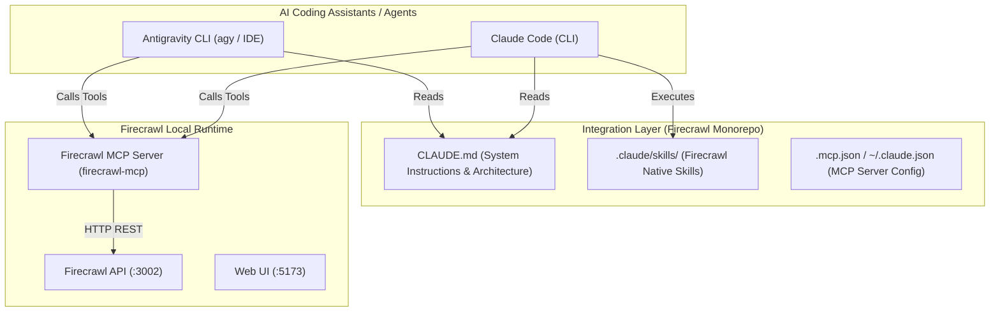

# Kế hoạch tích hợp Firecrawl với Claude Code và Antigravity CLI (Tương tự Javis OS)

> **Mục tiêu:** Thiết lập cấu hình toàn diện để **Claude Code** và **Antigravity CLI** có thể trực tiếp tương tác, điều khiển và sử dụng toàn bộ sức mạnh của Firecrawl (Scrape, Crawl, Search, Extract) thông qua MCP Server, Skills, và Project Prompt tương tự kiến trúc của dự án JAVIS OS.

---

## 1. Phân tích kiến trúc tích hợp



---

## 2. Các hạng mục triển khai chi tiết

### Hạng mục 1: Chuẩn hóa `CLAUDE.md` tại thư mục gốc
- Xây dựng file `CLAUDE.md` tiêu chuẩn cao (tương tự như `D:\code\javis-os\CLAUDE.md`), bao gồm:
  - Định nghĩa vai trò của AI Assistant khi làm việc với Firecrawl.
  - Tổng quan kiến trúc Monorepo (`apps/api`, `apps/ui`, `apps/*-sdk`).
  - Hướng dẫn vận hành hệ thống local (`http://localhost:3002`, `http://localhost:5173`).
  - Các quy tắc an toàn, quy chuẩn kiểm thử TDD (`pnpm harness jest ...`), không bypass knip.

### Hạng mục 2: Thiết lập `.claude/skills/`
- Tạo thư mục `.claude/skills/` trong repository và thiết lập các Skill chuyên dụng:
  - `firecrawl-scrape`: Hướng dẫn cào dữ liệu URL đơn lẻ, render JS, screenshot, PDF.
  - `firecrawl-search`: Hướng dẫn tìm kiếm thông tin trên Internet qua Firecrawl.
  - `firecrawl-extract`: Hướng dẫn trích xuất JSON có cấu trúc bằng LLM.
  - `firecrawl-crawl`: Hướng dẫn quét cây thư mục web và crawl đệ quy.

### Hạng mục 3: Cấu hình Firecrawl MCP Server cho Claude Code & Antigravity CLI
- Cấu hình file `.mcp.json` tại thư mục dự án:
  ```json
  {
    "mcpServers": {
      "firecrawl": {
        "command": "npx",
        "args": ["-y", "firecrawl-mcp"],
        "env": {
          "FIRECRAWL_API_URL": "http://localhost:3002",
          "FIRECRAWL_API_KEY": ""
        }
      }
    }
  }
  ```
- Cập nhật MCP cho Claude Code toàn cục (`~/.claude.json`) hoặc đăng ký trực tiếp qua lệnh `claude mcp add`.

---

## 3. Quy trình thực hiện & Tiêu chí nghiệm thu

- [ ] **Bước 1:** Khởi tạo `.claude/skills/` và đồng bộ các skill từ `skills/` vào `.claude/skills/`.
- [ ] **Bước 2:** Nâng cấp và mở rộng file `CLAUDE.md` tại gốc `D:\code\firecrawl`.
- [ ] **Bước 3:** Tạo file cấu hình `.mcp.json` kết nối với Firecrawl API local `http://localhost:3002`.
- [ ] **Bước 4:** Kiểm tra khả năng gọi công cụ và nhận diện của Claude Code / Antigravity CLI.
