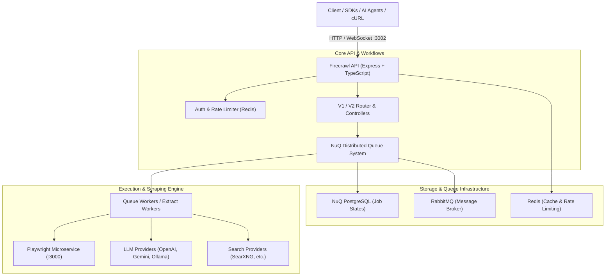

# Kế hoạch tìm hiểu, giới thiệu chi tiết và vận hành Firecrawl

> **Mục tiêu:** Cung cấp tài liệu phân tích kiến trúc chuyên sâu, hướng dẫn cài đặt - cấu hình chi tiết, và quy trình chạy/kiểm thử toàn diện nền tảng Firecrawl trên môi trường local/self-hosted.

---

## 1. Tổng quan & Bản chất của Firecrawl

**Firecrawl** là một nền tảng mã nguồn mở (Open-source Web Data Platform) được thiết kế chuyên biệt để biến toàn bộ nội dung web thành dữ liệu sạch (Markdown, Clean HTML, Structured JSON) tối ưu cho các mô hình AI/LLM, Agentic Workflows và hệ thống RAG (Retrieval-Augmented Generation).

### Các năng lực cốt lõi:
- **Scrape (`/v1/scrape`, `/v2/scrape`)**: Thu thập nội dung từ 1 URL bất kỳ. Tự động xử lý dynamic JavaScript (SPA, React/Vue), bypass anti-bot, chụp màn hình (screenshot), xuất Markdown sạch hoặc HTML tối giản.
- **Crawl (`/v1/crawl`, `/v2/crawl`)**: Thu thập toàn bộ website theo đường dẫn đệ quy, kiểm soát độ sâu (`maxDepth`), giới hạn số trang (`limit`), lọc Regex URL, hỗ trợ sitemap XML, và cập nhật trạng thái qua Webhook / WebSocket.
- **Map (`/v1/map`, `/v2/map`)**: Khám phá thần tốc toàn bộ URL của một tên miền mà không cần tải nội dung trang (dựa vào sitemap và search index).
- **Extract (`/v1/extract`, `/v2/extract`)**: Trích xuất dữ liệu có cấu trúc (Structured Output) theo JSON Schema thông qua LLM (OpenAI, Gemini, Ollama, DeepSeek).
- **Search (`/v1/search`, `/v2/search`)**: Tìm kiếm thông tin trên Internet qua engine tìm kiếm (SearXNG / Serper / v.v.) và trả về Markdown đầy đủ của từng kết quả.
- **Batch Scrape & Parse (`/v2/batch/scrape`, `/v2/parse`)**: Thu thập hàng loạt song song nhiều URL; parse file PDF, DOCX, hình ảnh thành văn bản sạch.
- **Browser Actions (`actions`)**: Tương tác mô phỏng người dùng: click, type, scroll, wait for selector trước khi bóc tách dữ liệu.

---

## 2. Kiến trúc hệ thống (System Architecture)



### Các thành phần chính trong Monorepo:
1. `apps/api`: Trọng tâm dịch vụ chứa Express REST API, V1/V2 routing, logic điều phối crawler, queue reconciler, LLM extraction engine.
2. `apps/playwright-service-ts`: Microservice headless browser chuyên biệt, chạy Chromium trên Playwright để render JS và thực thi browser actions.
3. `apps/nuq-postgres`: Cơ sở dữ liệu PostgreSQL mở rộng được tối ưu riêng cho hàng đợi NuQ phân tán.
4. `apps/*-sdk`: Bộ SDK chính thức đa ngôn ngữ (Python, TypeScript/JS, Go, Rust, Java, .NET, PHP, Ruby, Elixir).
5. `firecrawl-cli` & `skills`: Công cụ CLI và giao thức tích hợp AI Agent (MCP - Model Context Protocol).

---

## 3. Kế hoạch triển khai & vận hành (Step-by-step Execution Plan)

### Giai đoạn 1: Chuẩn bị môi trường & Thiết lập cấu hình
- **Bước 1.1**: Kiểm tra tài nguyên máy host (Docker Engine, Docker Compose, Port `3002`, `6379`, `5432`, `5672`).
- **Bước 1.2**: Khởi tạo file cấu hình môi trường `.env` tại thư mục gốc repository.
  - Thiết lập chế độ chạy tự lưu trữ cơ bản (`USE_DB_AUTHENTICATION=false`, `PORT=3002`).
  - Cấu hình tùy chọn LLM (OpenAI API Key / Ollama Base URL nếu cần tính năng Extract).

### Giai đoạn 2: Khởi động Firecrawl Stack qua Docker Compose
- **Bước 2.1**: Build và khởi chạy toàn bộ cụm dịch vụ:
  ```powershell
  docker compose up -d --build
  ```
- **Bước 2.2**: Giám sát trạng thái khởi động của các containers:
  - `firecrawl-api-1`
  - `firecrawl-playwright-service-1`
  - `firecrawl-nuq-postgres-1`
  - `firecrawl-rabbitmq-1`
  - `firecrawl-redis-1`
- **Bước 2.3**: Kiểm tra log API để xác nhận hệ thống sẵn sàng tiếp nhận request:
  ```powershell
  docker compose logs -f api
  ```

### Giai đoạn 3: Kiểm thử chức năng & Xác thực (Verification)
- **Bước 3.1: Kiểm tra API Health / Root**:
  - Gửi request `GET http://localhost:3002/test` hoặc `GET http://localhost:3002/`
- **Bước 3.2: Kiểm thử Scrape đơn giản (`/v1/scrape`)**:
  - Scrape trang tĩnh/động (ví dụ: `https://example.com` hoặc `https://news.ycombinator.com`).
  - Kiểm tra kết quả trả về gồm Markdown, metadata, status code 200.
- **Bước 3.3: Kiểm thử Crawl đệ quy (`/v1/crawl`)**:
  - Gửi yêu cầu crawl với giới hạn `limit=3`, kiểm tra cơ chế polling status (`/v1/crawl/status/{jobId}`).
- **Bước 3.4: Kiểm thử Map URL (`/v1/map`)**:
  - Trích xuất danh sách liên kết nhanh từ sitemap của 1 trang web mục tiêu.

### Giai đoạn 4: Hướng dẫn tích hợp & Sử dụng SDKs / CLI
- Cung cấp mẫu code gọi API bằng:
  - `cURL` / `PowerShell Invoke-RestMethod`
  - Python SDK (`firecrawl-py`)
  - Node.js/TypeScript SDK (`@mendable/firecrawl-js`)
- Hướng dẫn thiết lập Model Context Protocol (MCP) để kết nối Firecrawl trực tiếp với Cursor/Claude/Antigravity Agent.

---

## 4. Kế hoạch kiểm thử & Tiêu chuẩn nghiệm thu (Acceptance Criteria)

| STT | Hạng mục kiểm tra | Tiêu chuẩn đạt | Phương thức kiểm tra |
|---|---|---|---|
| 1 | Docker Containers | 100% services (`api`, `playwright`, `redis`, `rabbitmq`, `postgres`) ở trạng thái `running` / `healthy` | `docker compose ps` |
| 2 | API Sẵn sàng | Endpoint `http://localhost:3002` phản hồi HTTP 200 | `curl http://localhost:3002/test` |
| 3 | Single Scrape | Trả về định dạng Markdown đầy đủ và sạch sẽ | `POST /v1/scrape` với url mẫu |
| 4 | Map Discovery | Trả về mảng danh sách URL hợp lệ | `POST /v1/map` với domain mẫu |
| 5 | Asynchronous Crawl | Job crawl được ghi nhận, worker xử lý thành công, trả về trạng thái `completed` | `POST /v1/crawl` & `GET /v1/crawl/status/:id` |
