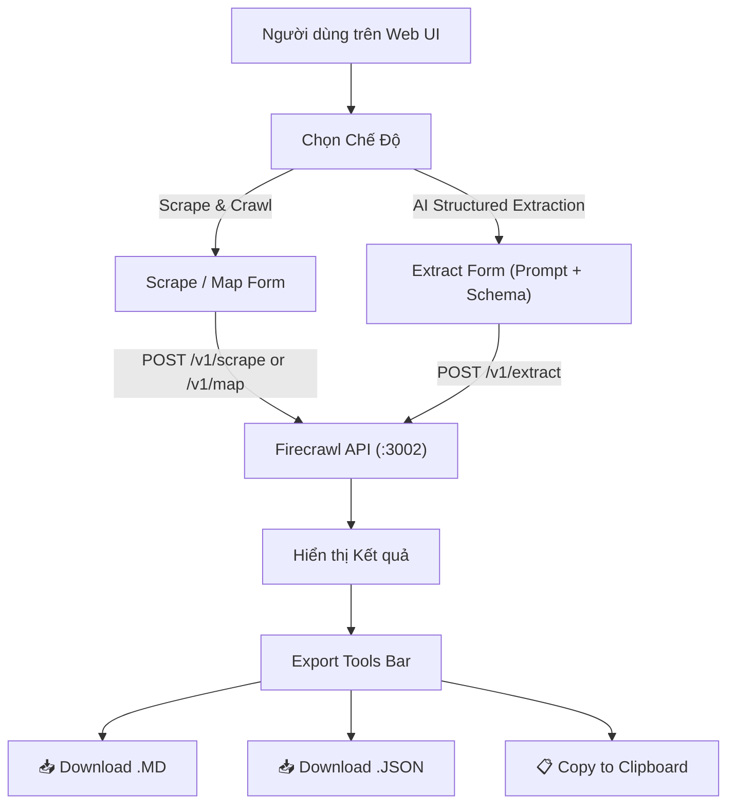

# Kế hoạch phát triển: Tích hợp Structured Extraction & Nút Tải Dữ Liệu trên Web UI

> **Mục tiêu:** Bổ sung tính năng **AI Structured Extraction (`/v1/extract`)** và các nút **Tải dữ liệu (Download Markdown, Download JSON, Copy to Clipboard)** trực tiếp trên giao diện Web UI (`apps/ui/ingestion-ui`).

---

## 1. Yêu cầu chi tiết & Phân tích tính năng

### Tính năng A: AI Structured Extraction (`/v1/extract`) trên Web UI
- **Giao diện chuyển đổi Mode (Tabs):**
  - **Tab 1:** `Scrape & Crawl` (Cào văn bản Markdown / Khám phá liên kết).
  - **Tab 2:** `AI Structured Extraction` (Trích xuất dữ liệu có cấu trúc bằng LLM).
- **Form nhập liệu cho AI Extract:**
  - `URLs`: Nhập 1 hoặc nhiều URL.
  - `Prompt`: Câu lệnh hướng dẫn AI trích xuất thông tin gì.
  - `JSON Schema (Tùy chọn)`: Khung JSON Schema mẫu có thể bật/tắt để tùy chỉnh cấu trúc trả về chặt chẽ.
- **Xử lý gọi API:**
  - Gửi POST request tới `http://localhost:3002/v1/extract` kèm `urls`, `prompt`, `schema`.
  - Hiển thị thanh tiến trình / loading trạng thái.
- **Hiển thị kết quả trích xuất:**
  - Hiển thị kết quả dạng JSON được định dạng đẹp mắt (Syntax Highlighting).

### Tính năng B: Bộ công cụ Xuất & Tải Dữ Liệu (Export & Download Tools)
- **Tải toàn bộ kết quả (Batch Download):**
  - 📥 **Download All as Markdown (`.md`)**: Ghép toàn bộ nội dung markdown của các trang đã cào và tải về máy.
  - 📥 **Download All as JSON (`.json`)**: Xuất toàn bộ dữ liệu (metadata, nội dung, LLM extraction) thành file `.json`.
  - 📋 **Copy All to Clipboard**: Sao chép nhanh toàn bộ kết quả.
- **Tải kết quả từng trang (Single Item Download):**
  - Mỗi card kết quả có nút:
    - 📥 Tải file `.md` hoặc `.json` riêng của trang đó.
    - 📋 Copy nội dung riêng của trang đó.

---

## 2. Kiến trúc & Các tệp sẽ thay đổi

### Các tệp cần sửa đổi / tạo mới:
1. `apps/ui/ingestion-ui/src/components/ingestionV1.tsx`:
   - Tích hợp Tab Mode Switcher (`Scrape & Crawl` vs `AI Extract`).
   - Thêm state & form xử lý `prompt`, `schema`, `extractResults`.
   - Thêm Export Toolbar (Download Markdown, Download JSON, Copy Clipboard).
   - Thêm helper download file (Blob URL generator).
2. `apps/ui/ingestion-ui/src/components/ui/tabs.tsx` (nếu cần component tab hoặc custom segmented control).

---

## 3. Quy trình thực hiện (Execution Steps)

- [ ] **Bước 1:** Bổ sung hàm tiện ích tải file (`downloadFile(filename, content, mimeType)`) và sao chép clipboard (`copyToClipboard(text)`).
- [ ] **Bước 2:** Xây dựng giao diện chuyển đổi giữa chế độ `Scrape / Crawl` và `AI Structured Extraction`.
- [ ] **Bước 3:** Thêm form nhập `Prompt` và `JSON Schema` trong chế độ AI Extract, kết nối gọi endpoint `POST /v1/extract`.
- [ ] **Bước 4:** Xây dựng thanh công cụ tải dữ liệu (Export Toolbar) cho cả kết quả Scrape và kết quả AI Extract.
- [ ] **Bước 5:** Kiểm thử trực tiếp trên Web UI `http://localhost:5173`.
