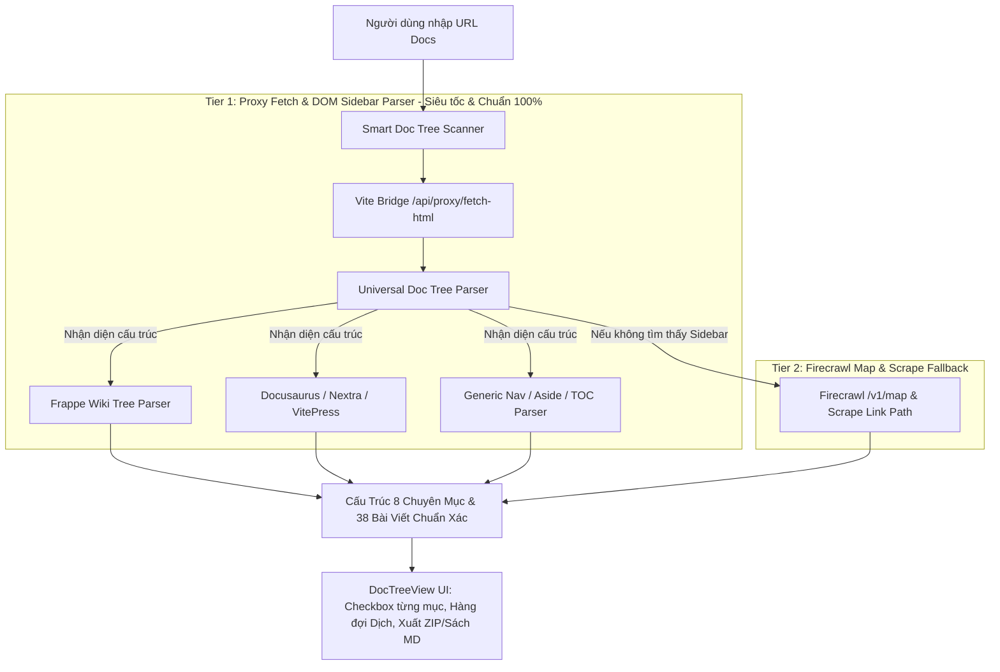

# Kế Hoạch Nâng Cấp: Smart Documentation Tree Parser & Crawler
*(Khắc phục triệt để vấn đề quét thiếu cây mục lục và hỗ trợ nhận diện tự động 100% chuyên mục / bài viết của các trang tài liệu)*

---

## 1. Khảo Sát & Phân Tích Nguyên Nhân Gốc Rễ (Root Cause Analysis)

### 1.1 Hiện trạng phát hiện từ thực tế
1. **Trang tài liệu thực tế (`https://docs.frappe.io/education` hoặc `https://docs.frappe.io/education/introduction`)**:
   - Có **8 chuyên mục lớn** (General Education, Student Management, Attendance, Program Management, Course Management, Assessment, Fees Management, Others).
   - Có **38 bài viết con** được hiển thị trực tiếp trong cây Sidebar Navigation.
2. **Nguyên nhân hệ thống cũ chỉ quét được 1 bài**:
   - Firecrawl `/v1/map` chỉ trả về 1 URL `https://docs.frappe.io/education` vì website không cung cấp sitemap XML cho sub-paths hoặc không cào sâu vào cây DOM bên trong.
   - Khi quét link gốc `https://docs.frappe.io/education`, cơ chế cũ dựa vào bộ phân tách URL tĩnh thuần túy mà chưa phân tích cấu trúc cây DOM (Sidebar/Tree navigation) của trang web.

---

## 2. Giải Pháp Xây Dựng: Multi-Tier Smart Doc Tree Discovery

---

## 3. Chi Tiết Các Hạng Mục Sẽ Triển Khai

### 3.1 Nâng Cấp Vite Server Bridge (`vite-plugin-cli.ts`)
- Thêm endpoint `/api/proxy/fetch-html`:
  - Cho phép tải nhanh mã HTML của trang tài liệu (không bị hạn chế CORS trình duyệt).
  - Tự động nhận diện và xử lý URL gốc (nếu người dùng nhập `https://docs.frappe.io/education`, tự động thử thêm `/introduction` hoặc theo dõi redirect).

### 3.2 Nâng Cấp Bộ Phân Tích Cây Mục Lục (`src/lib/docTreeScanner.ts`)
- **Tích hợp Universal DOM Sidebar Parser**:
  1. **Frappe Docs Engine**: Nhận diện cấu trúc `<li class="wiki-item is-group">`, nút nhóm `<button class="wiki-item-content">` và danh sách bài con `<a>`, bóc tách chính xác tên chuyên mục và tên hiển thị từng bài viết.
  2. **Docusaurus / VitePress / GitBook Engine**: Tự động bóc tách các thẻ `<nav>`, `<aside>`, class `menu__list`, `sidebar-group`.
  3. **Cơ chế Deduplication thông minh**: Tự động lọc trùng lặp giữa menu Mobile và menu Desktop.
  4. **Fallback mượt mà**: Nếu trang web là dạng tĩnh thông thường không có Sidebar, tự động dùng Firecrawl Map và Path analysis.

### 3.3 Tối Ưu Giao Diện & Trải Nghiệm (`BatchDocExtractor.tsx`)
- Hiển thị ngay số lượng chuyên mục và số lượng bài viết phát hiện được (Ví dụ: `8 chuyên mục, 38 bài viết`).
- Cho phép người dùng nhập hoặc chỉnh sửa danh sách link thủ công (Custom URL Import) nếu cần.
- Tự động mở rộng chuyên mục đầu tiên để người dùng dễ quan sát.

---

## 4. Kế Hoạch Xác Minh & Kiểm Thử (Verification Plan)

1. **Kiểm thử quét link Frappe Education**:
   - Nhập `https://docs.frappe.io/education` hoặc `https://docs.frappe.io/education/introduction`.
   - Bấm **"Quét Cây Mục Lục"** -> Đảm bảo hiển thị đầy đủ 8 chuyên mục và 38 bài viết.
2. **Kiểm thử chọn lọc & dịch thuật**:
   - Chọn thử 1 chuyên mục (ví dụ `General Education` - 4 bài).
   - Bấm **"Bắt Đầu Dịch Hàng Loạt"** -> Đảm bảo chạy mượt mà qua Antigravity CLI / Claude Code CLI.
3. **Kiểm thử xuất file**:
   - Xuất file `.zip` -> Đảm bảo đủ các thư mục và file `.md`.
   - Xuất Sách `.md` -> Đảm bảo mục lục TOC liên kết chuẩn.
