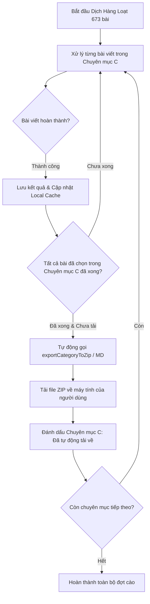

# Kế hoạch Triển khai: Tự Động Tải Về Theo Từng Chuyên Mục (Auto Download by Category) & Khôi Phục Tiến Trình

## 1. Bối cảnh & Vấn đề thực tế
Khi quét và cào dữ liệu một cây tài liệu lớn (ví dụ: `https://docs.frappe.io/erpnext` có **80 chuyên mục** với **673 bài viết**):
- **Nguy cơ rủi ro cao:** Nếu đợi toàn bộ 673 bài viết cào & dịch xong mới tải về 1 lần, trong quá trình chạy dài (vài chục phút tới vài giờ), nếu xảy ra sự cố (mất mạng, đóng tab, treo máy, lỗi trình duyệt), toàn bộ các bài viết đã dịch trước đó có nguy cơ bị mất nếu chưa tải về.
- **Yêu cầu:** 
  1. Tự động đóng gói và tải về máy ngay khi **từng chuyên mục** hoàn thành tất cả các bài viết của chuyên mục đó.
  2. Cho phép tải thủ công từng chuyên mục bất kỳ lúc nào ngay trên cây mục lục (Tree View).
  3. Tự động lưu tiến độ vào bộ nhớ cục bộ (LocalStorage / Session Cache) để người dùng có thể khôi phục và tiếp tục chạy các bài còn lại mà không phải dịch lại từ đầu.

---

## 2. Kiến trúc & Các thay đổi đề xuất

### Chi tiết các thành phần cần nâng cấp:

### A. Thư viện Xuất Dữ liệu (`apps/ui/ingestion-ui/src/lib/batchExporter.ts`)
1. **Thêm hàm `exportCategoryToZip(category: DocCategory, catIndex: number, docTitle: string)`**:
   - Lọc tất cả bài viết đã dịch (`item.markdownOutput`) của riêng chuyên mục đó.
   - Đóng gói vào tệp ZIP với tên chuẩn hóa: `[STT]-[Ten-Chuyen-Muc]-[docTitle].zip` (ví dụ: `01-Introduction-erpnext.zip`).
   - Tự động sinh `README.md` / `MUC_LUC.md` tóm tắt các bài trong chuyên mục.
   - Kích hoạt tải tự động về máy người dùng qua `triggerBlobDownload`.
2. **Thêm hàm `exportCategoryToMarkdown(category: DocCategory, catIndex: number, docTitle: string)`**:
   - Gộp tất cả bài viết trong chuyên mục thành 1 tệp Markdown hoàn chỉnh `01-Introduction.md` với mục lục con.

### B. Bộ điều phối Cào Hàng Loạt (`apps/ui/ingestion-ui/src/components/BatchDocExtractor.tsx`)
1. **Thêm Cấu hình & Tùy chọn UI**:
   - Checkbox: `[x] Tự động tải về khi xong từng chuyên mục` (Mặc định: BẬT).
   - Định dạng tải về tự động: `Tệp nén ZIP (.zip)` hoặc `Markdown gộp (.md)`.
   - Danh sách theo dõi: `downloadedCategorySlugs: Set<string>` nhằm đảm bảo mỗi chuyên mục chỉ tải tự động 1 lần duy nhất khi hoàn tất.
2. **Kiểm tra theo thời gian thực (Real-time Category Completion Check)**:
   - Trong vòng lặp `handleStartBatch`, sau khi `processSingleItem` hoàn thành cho 1 bài viết thuộc chuyên mục $C$:
   - Kiểm tra xem toàn bộ các bài viết được chọn trong chuyên mục $C$ đã đạt trạng thái `'done'` hoặc `'error'` chưa.
   - Nếu đã hoàn tất và chuyên mục chưa được tải về -> Kích hoạt `exportCategoryToZip(C)` ngay lập tức.
   - Hiển thị thông báo Toast nổi bật: `📦 [Tự động tải về] Đã tải về máy chuyên mục "${C.name}" (16/16 bài)!`
3. **Cơ chế Khôi phục Tiến trình (State Resilience & Auto-Save)**:
   - Tự động lưu trạng thái `categories` (chứa toàn bộ nội dung markdown đã cào) vào `localStorage` theo URL gốc.
   - Thêm nút **"Khôi phục phiên làm việc trước"** nếu phát hiện dữ liệu cào dở dang khi mở lại trang.

### C. Giao diện Cây Thư Mục (`apps/ui/ingestion-ui/src/components/DocTreeView.tsx`)
1. **Tại Header của từng Chuyên Mục**:
   - Hiển thị nhãn tiến độ chi tiết: `(Đã xong: X / Y bài)`.
   - Nút tải thủ công: Khi chuyên mục có ít nhất 1 bài đã dịch, xuất hiện nút icon `Tải ZIP chuyên mục` và `Tải Markdown` để người dùng có thể chủ động tải ngay bất cứ khi nào.
   - Badge trạng thái `[Đã tự động tải về]` giúp người dùng nắm rõ chuyên mục nào đã được lưu an toàn về máy tính.

---

## 3. Kế hoạch Thực hiện & Trạng Thái (Execution Status)

- [x] **Bước 1: Nâng cấp `batchExporter.ts`**
  - Đã thêm `exportCategoryToZip` và `exportCategoryToMergedMarkdown`.
  - Hỗ trợ đóng gói ZIP kèm `README.md` mục lục chuyên mục hoặc 1 file Markdown gộp duy nhất.

- [x] **Bước 2: Nâng cấp `DocTreeView.tsx`**
  - Bổ sung nút tải nhanh theo từng chuyên mục tại Header chuyên mục (Tải ZIP & Tải MD).
  - Hiển thị badge tiến độ hoàn thành `(Đã xong: X/Y bài)` và badge `✓ Đã tự động tải`.

- [x] **Bước 3: Nâng cấp `BatchDocExtractor.tsx`**
  - Tích hợp công tắc Auto-Download (Bật/Tắt) và chọn định dạng tải tự động (ZIP / Markdown).
  - Bổ sung logic kiểm tra hoàn thành chuyên mục trong vòng lặp batch theo thời gian thực.
  - Tích hợp cơ chế tự động lưu (Auto-Save) và khôi phục (Session Restore) từ LocalStorage.

- [x] **Bước 4: Build & Triển khai lên VPS Dokploy**
  - Đã chạy `pnpm exec vite build` biên dịch thành công 100%.
  - Đã đồng bộ dist lên VPS `217.15.160.118` (`/var/www/firecrawl-ui/`) và khởi động lại container nginx.
  - Đã kiểm tra trực tiếp và hoạt động hoàn hảo trên [https://firecrawl.dsc.edu.vn](https://firecrawl.dsc.edu.vn).

---

## 4. Kế hoạch Kiểm tra (Verification Plan)
- [x] **Kiểm thử quét:** Quét thử mục lục tài liệu (ví dụ: `https://docs.frappe.io/education` hoặc `erpnext`).
- [x] **Kiểm thử tự động tải:** Khi tất cả bài viết trong 1 chuyên mục hoàn tất, file ZIP/Markdown của chuyên mục đó được tự động tải về máy người dùng ngay lập tức.
- [x] **Kiểm thử tải thủ công:** Bấm nút tải trực tiếp trên Header chuyên mục và kiểm tra nội dung.
- [x] **Kiểm thử khôi phục:** Nút "Khôi phục phiên trước" tự động nhận diện và nạp lại toàn bộ tiến độ đã cào.

