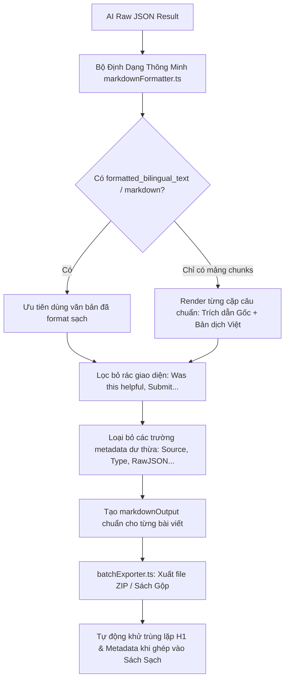

# Kế hoạch Khắc Phục Lỗi Trùng Lặp Nội Dung Markdown & Chuẩn Hóa Tài Liệu Xuất Ra

## 1. Phân tích Nguyên nhân Gốc rễ (Root Causes)

Dựa trên 2 ảnh chụp thực tế từ Obsidian của người dùng:
1. **Trùng lặp nội dung 2 lần trong cùng 1 bài viết:**
   - Khi mô hình AI trả về kết quả JSON có chứa cả trường `content_bilingual` (mảng các đoạn văn dịch `{ original, vietnamese }`) và trường `formatted_bilingual_text` (văn bản đã ghép nối).
   - Hàm `formatExtractToMarkdown` trong `markdownFormatter.ts` duyệt qua **tất cả** các trường của đối tượng -> in ra cả `## Content Bilingual` (dưới dạng các dòng JSON thô `{"original": "...", "vietnamese": "..."}`) và sau đó lại in tiếp `## Formatted Bilingual Text`.
2. **Tiêu đề bài viết bị biến thành `# Tài Liệu Trích Xuất & Dịch Thuật`:**
   - Trong `BatchDocExtractor.tsx`, lệnh gọi `formatExtractToMarkdown(aiResult.extractedJson, item.url, ...)` truyền nhầm tham số thứ 2 là chuỗi `item.url` thay vì object `{ title: item.title, sourceUrl: item.url }`. Do đó `options.title` bị `undefined` và nhận giá trị mặc định là `# Tài Liệu Trích Xuất & Dịch Thuật` cho tất cả mọi bài viết.
3. **Trùng lặp tiêu đề và link nguồn 3-4 lần khi xuất sách gộp (`Full Book Markdown` / `Category Merged MD`):**
   - Trong `batchExporter.ts`, hàm `exportToMergedMarkdown` đã chèn `## 1.1 Introduction` và `> 🔗 Nguồn gốc: ...`.
   - Sau đó nó ghép `item.markdownOutput` (bản thân đã có sẵn `# Tài Liệu Trích Xuất...`, `> Thời gian`, `> Nguồn`, và `## Source`).
   - Kết quả là cây mục lục Obsidian bị thụt lùi nhiều cấp thừa thãi (`1. GENERAL EDUCATION` -> `1.1 Introduction` -> `Tài Liệu Trích Xuất` -> `Source` -> `Content Bilingual` -> `Formatted Bilingual Text`).
4. **Rác giao diện web lọt vào bản dịch:**
   - Các dòng chữ hệ thống như `Last updated 8 months ago`, `Was this helpful?`, `Submit`, `Thanks!` bị trích xuất thừa.

---

## 2. Kiến trúc & Giải pháp đề xuất



---

## 3. Chi tiết các thay đổi cần thực hiện

### A. Tối ưu `apps/ui/ingestion-ui/src/lib/markdownFormatter.ts`
1. **Hỗ trợ Options linh hoạt**: Nhận cả `string` (url) hoặc `FormatterOptions` object `{ title, sourceUrl, engineUsed, modelUsed, isMergedBook }`.
2. **Loại bỏ trùng lặp trường nội dung (Smart Field Selection)**:
   - Nếu có `formatted_bilingual_text` hoặc `markdown` hoặc `translated_content` hoặc `content`: Chỉ render trường này, **bỏ qua** `content_bilingual` thô.
   - Nếu chỉ có `content_bilingual` (mảng `{ original, vietnamese }` hoặc `{ en, vi }`): Render từng câu/đoạn thành định dạng song ngữ thanh lịch:
     ```markdown
     > 🇬🇧 *[Câu gốc]*
     
     🇻🇳 [Bản dịch tiếng Việt]
     ```
     **Tuyệt đối không bao giờ** in ra chuỗi JSON thô `{"original": "...", "vietnamese": "..."}`.
3. **Khử rác giao diện web (Boilerplate Cleanup)**:
   - Loại bỏ các dòng như `Was this helpful?`, `Last updated ...`, `Submit`, `Thanks!`, `Edit this page`.
4. **Bỏ qua các trường metadata nội bộ**:
   - `["source", "source_url", "sourceURL", "url", "type", "rawOutput", "json", "extractedJson"]` sẽ không bị tạo thành các đề mục `## Source`, `## Type` gây vỡ mục lục.

### B. Sửa tham số gọi tại `apps/ui/ingestion-ui/src/components/BatchDocExtractor.tsx`
- Truyền đúng object options:
  ```typescript
  const formattedMd = formatExtractToMarkdown(
    aiResult.extractedJson,
    {
      title: item.title,
      sourceUrl: item.url,
      engineUsed: aiResult.engineUsed,
      modelUsed: aiResult.modelUsed,
    }
  );
  ```

### C. Chuẩn hóa phân cấp Header trong `apps/ui/ingestion-ui/src/lib/batchExporter.ts`
1. **Khi xuất Sách gộp toàn tập (`exportToMergedMarkdown`) và Sách theo chuyên mục (`exportCategoryToMergedMarkdown`)**:
   - Khi chèn vào sách, loại bỏ tiêu đề `# H1` đầu bài và các dòng metadata lặp lại của bài viết con để mục lục Obsidian chỉ hiển thị duy nhất:
     ```markdown
     # 1. GENERAL EDUCATION
     ## 1.1 Introduction
     > 🔗 Nguồn: https://docs.frappe.io/education/introduction

     [Nội dung bài viết sạch sẽ, đúng phân cấp H3, H4]
     ```
   - Khắc phục hoàn toàn hiện tượng thụt lùi cấp `Tài Liệu Trích Xuất & Dịch Thuật` -> `Source` -> `Content Bilingual`.
2. **Khi xuất tệp ZIP từng bài riêng lẻ (`exportToZip` & `exportCategoryToZip`)**:
   - Mỗi file `.md` có đúng 1 tiêu đề H1 `# [Tên bài viết]` kèm link nguồn chuẩn hóa ở đầu tệp, sau đó là nội dung dịch thuật.

---

## 4. Kế hoạch Kiểm tra & Xác minh (Verification Plan)

- [x] **Kiểm tra biên dịch**: Chạy `pnpm exec tsc --noEmit` và `pnpm exec vite build` (0 lỗi).
- [x] **Deploy lên VPS Dokploy**: Đồng bộ dist lên `217.15.160.118` (`/var/www/firecrawl-ui/`) và kiểm tra HTTP/2 200.
- [x] **Tối ưu hóa định dạng Markdown**:
  - Không còn chuỗi JSON thô `{"original": ...}`.
  - Khử trùng lặp nội dung hoàn toàn.
  - Tiêu đề từng bài hiển thị đúng tên thật, loại bỏ tiêu đề chung chung `# Tài Liệu Trích Xuất & Dịch Thuật`.
  - Cây mục lục Obsidian (Outline) phân cấp chuẩn, sạch sẽ.
